# Welcome to EDS 222!

## Statistics for Environmental Data Science

Instructional team: Max Czapanskiy and Sloane Stephenson

## Today's goals

1.  **Describe** the challenges of statistical inference and **identify** them in an Environmental Justice (EJ) case study
2.  **Define** *validity*, *reliability*, and *sampling* in the context of measurements and data
3.  **Prepare** for success in this course

# Challenges of statistical inference

## Navigating uncertainty

-   If we could directly observe everything without error, we wouldn't need statistics
-   In practice, we only get a glimpse through a window at what we care about
-   Statistics is the practice of interpreting data to understand the whole from the limited part we can see

## Challenges of statistical inference

1.  Generalizing from sample to population
2.  Generalizing from treatment to control group
3.  Generalizing from observed measurements to underlying constructs of interest

[@ros]

## Neither math nor magic

Statistics uses math (just like any other field of science) but it's not a *type* of math

-   Sure, calculus and linear algebra can be useful, but we'll mostly bypass them
-   Instead, we will instead use *simulation* to develop (and test) conceptual models

## Neither math nor magic

To perform a statistical analysis *responsibly* you need to understand the assumptions and risks

> Many applications of statistics ... invoke statistical terms and procedures as ***incantations***, with scant understanding of the assumptions or relevance of the calculations, or even the meaning of the terminology. This demotes statistics from a ***way of thinking about evidence*** and avoiding self-deception to a formal ***“blessing” of claims***.

[@stark2018]

## A way of thinking

-   In this class you will learn *statistical thinking* for assessing and interpreting evidence
-   We will avoid formulaic flowcharts for picking tests and models
-   The decisions and choices made by statistics practitioners have real world consequences

# East LA, Environmental Justice, and the Exide Battery Recycling Plant

## Are my children safe?


[March 13, 2014 in the *Los Angeles Times*](https://www.latimes.com/local/la-me-exide-neighborhood-20140314-story.html)

## Exide battery recycling plant

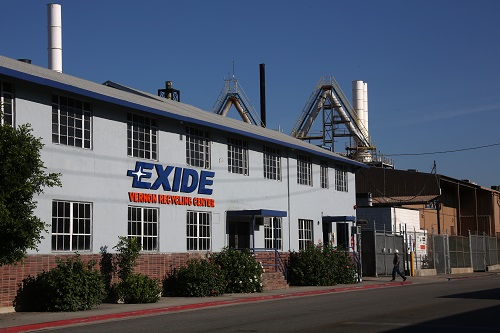

[March 23, 2013 in the *Los Angeles Times*](https://www.latimes.com/local/la-xpm-2013-mar-23-la-me-0324-exide-air-20130324-story.html)

## A history in three parts

**1922 - 2012: *A century of pollution***

**2013 - 2015: *Shut it down***

**2016 - present: *Is it safe now?***

# 1922 - 2012: *A century of pollution*

## Lead smelting operations begin in 1922

::::: columns
::: column
-   Plant opened in 1922 in Vernon, CA - an industrial city 5 miles from Downtown LA
-   1 of 2 lead battery recycling plants west of the Rockies
-   Emitted lead, arsenic, and other pollutants for 90 years
:::

::: column
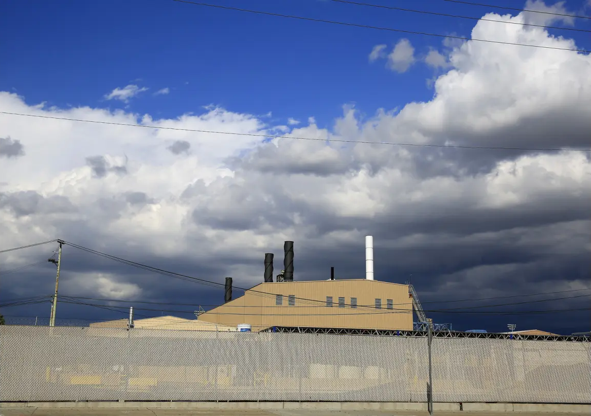
:::
:::::

## Lead from emissions, gas, and paint

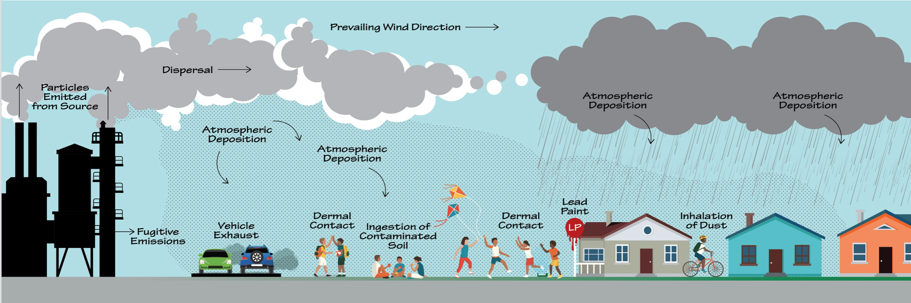

## Wind carried lead to nearby communities

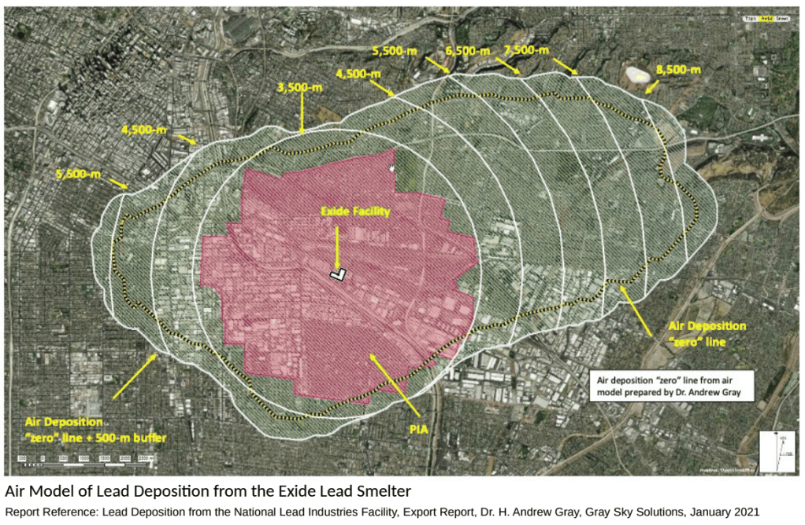

## How much lead is there?

What is the lead (Pb) soil concentration on this property? (1 #)

How *valid* is that number? I.e., how well does it represent what you're trying to measure?

::::: columns
::: {.column width="40%"}
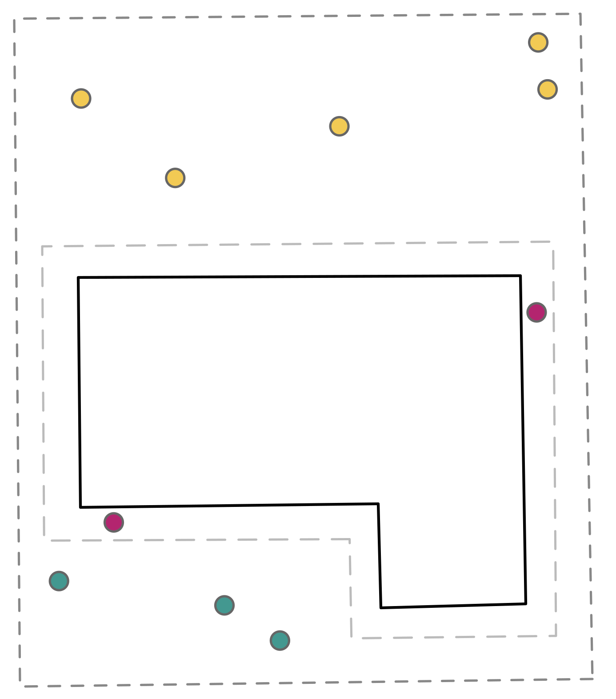{height="350px"}
:::

::: {.column width="60%"}
[Back yard]{style="color: white; background-color: #F2CA54;"} [Front yard]{style="color: white; background-color: #439890;"} [Drip line]{style="color: white; background-color: #B3256F;"}

```{r}
#| messages: false
#| echo: false
#| fig-width: 4
#| fig-height: 3
library(tidyverse)
set.seed(222)
theme_set(theme_classic(18))

tibble(
  location = c(rep("Back yard", 5), rep("Front yard", 3), rep("Drip line", 2)),
  `Soil Pb (ppm)` = c(204, 204, 187, 250, 209, 198, 182, 181, 285, 306)
) |>
  ggplot(aes(`Soil Pb (ppm)`, fill = location)) +
  geom_dotplot(method = "histodot", binwidth = 20, stackgroups = TRUE) +
  scale_y_continuous(NULL, breaks = NULL) +
  scale_fill_manual(values = c("#F2CA54", "#B3256F", "#439890")) +
  theme(legend.position = "none")
```
:::
:::::

## *Validity* of a measurement

> A measure is valid to the degree that it represents what you are trying to measure

[@ros, p. 24]

If the thing we care about is **risk of lead poisoning**, how *valid* are the following measurements?

-   Mean soil Pb concentration in the front and back yard of a property
-   Mean soil Pb concentration within 500 yards of a property
-   Maximum soil Pb concentration on a property

## *Generalize from sample to population*

**Given limited information about a sample, what can we say about the population?**

::::: columns
::: {.column width="47.5%"}
**Population**: the entire entity we're interested in

-   The soil Pb contamination **on a property**
-   The soil Pb contamination **in a radius around a pollution source**
:::

::: {.column width="5%"}
:::

::: {.column width="47.5%"}
**Sample**: the subset of the population we have data for

-   **Ten soil cores** from a property
-   "Representative" soil Pb values for **100 residential properties**
:::
:::::

## Where is the lead?

::::: columns
::: column
-   Over 10k homes within 2 km of the Exide plant
-   Initial sampling from 244 homes
-   *Generalize from sample to population*
:::

::: column
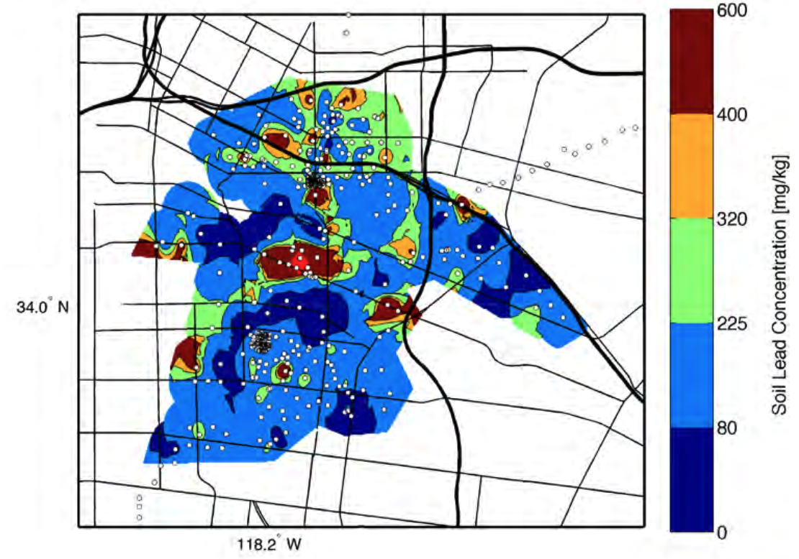

[@small2015]
:::
:::::

# 2013 - 2015: *Shut it down*

## Community organizations protest

::::: columns
::: column
Protests intensify in response to increasing violations and dangerous soil samples.

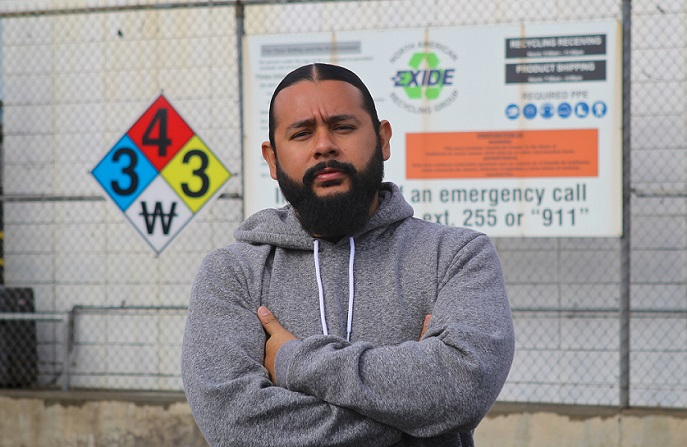
:::

::: column
> I’m the third generation of my family to fight the Exide smelter. My grandparents started back in the 1990s, and it took three generations of our communities to shut it down.

[Sierra Club](https://www.sierraclub.org/planet/2017/04/right-mark)
:::
:::::

## Exide argues it's not responsible

::::: columns
::: {.column width="40%"}
Other sources of lead include:

-   Leaded gas phased out 1973 (proximity to highways)
-   Leaded paint banned in 1978 (age of home)
:::

::: {.column width="60%"}
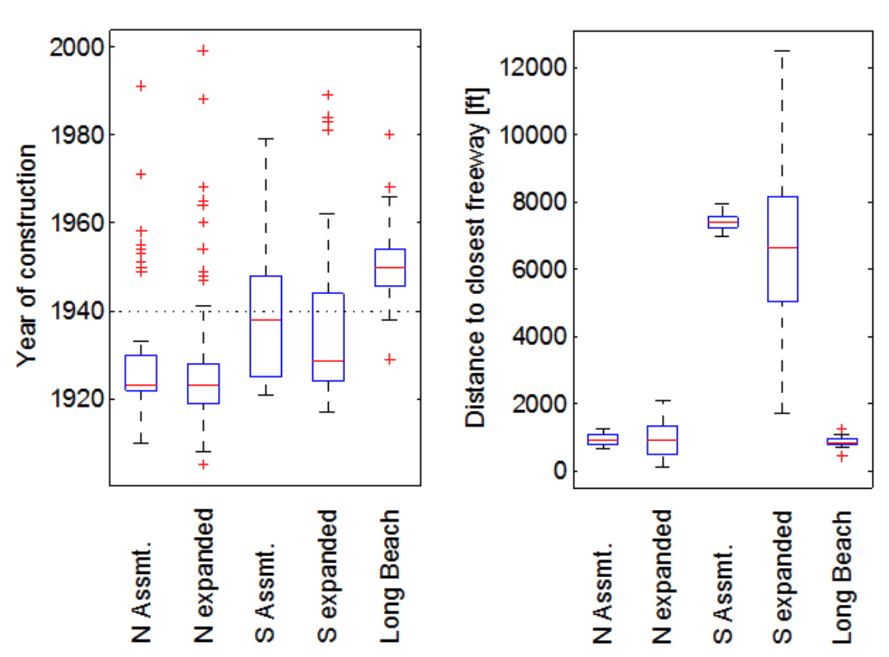
:::
:::::

## What's the ambient?

::::: columns
::: {.column width="50%"}
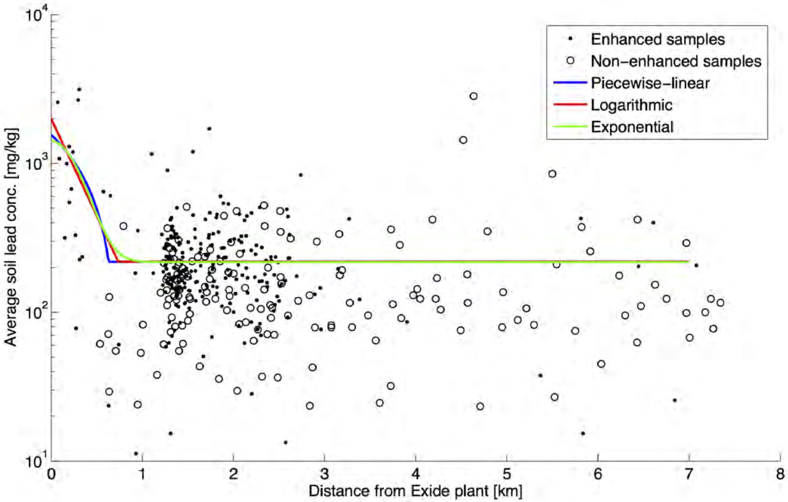
:::

::: {.column width="50%"}
-   Exide report estimated the mean ambient soil Pb level at **218 ppm**.

-   CA and EPA screen soil Pb for **80 ppm and 200 ppm**, respectively.

-   Median soil Pb in LA is **81 ppm** (Wu et al. 2010).
:::
:::::

## What's the radius?

::::: columns
::: {.column width="50%"}
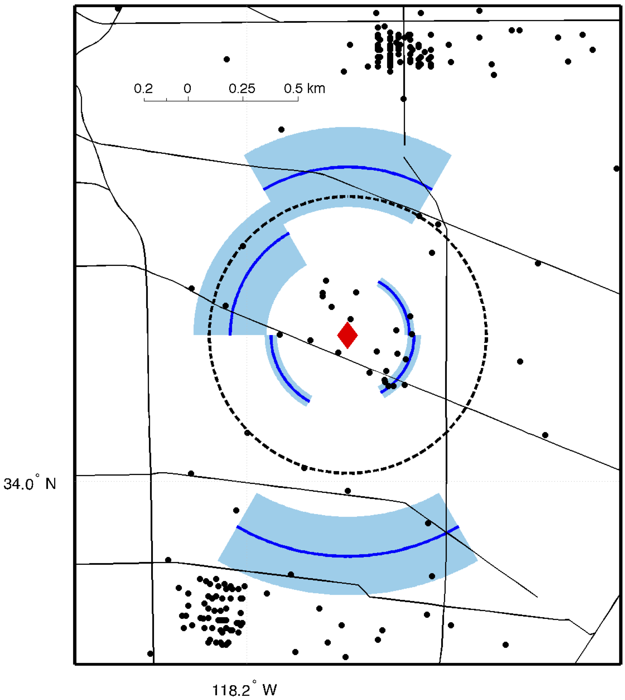{width="350px"}
:::

::: {.column width="50%"}
-   Exide estimated its **radius of effect** between **0.2 and 0.75 miles**, depending on wind direction.

-   DTSC disputed the ambient soil Pb; estimated radius between **1.3 and 1.7 miles**
:::
:::::

## *Reliability* of a measurement

> A reliable measure is one that is precise and stable.

[@ros p. 25]

::::: columns
::: column
Exide's argument attacked the *reliability* of soil Pb measurements.

1.  Collect duplicate samples
2.  Calculate difference of measurements
3.  Estimate an error "buffer"
:::

::: column
```{r}
#| fig-width: 4
#| fig-height: 2.5
pb_mu <- 129.2
pb_sigma <- 100
pb_mu_log <- log(pb_mu / sqrt(1 + pb_sigma^2 / pb_mu^2))
pb_sigma_log <- log(1 + pb_sigma^2 / pb_mu^2)

r_cov <- 0.136
# cov = sqrt(exp(sigma^2) - 1)
# cov^2 = exp(sigma^2) - 1
# cov^2 + 1 = exp(sigma^2)
# log(cov^2 + 1) = sigma^2
# sigma = sqrt(log(cov^2 + 1))
r_sigma <- sqrt(log(r_cov^2 + 1))
tibble(
  pb_t = rlnorm(25, meanlog = pb_mu_log, sdlog = pb_sigma_log),
  r1_log = rnorm(25, mean = 0, sd = r_sigma),
  r2_log = rnorm(25, mean = 0, sd = r_sigma),
  pb_1 = pb_t * exp(r1_log),
  pb_2 = pb_t * exp(r2_log),
  d = pb_2 - pb_1
) |>
  ggplot(aes(d)) +
  geom_dotplot(method = "histodot", binwidth = 10) +
  geom_vline(xintercept = c(-1, 1) * 35.14, color = "cornflowerblue") +
  labs(x = "Difference in duplicates (ppm)") +
  scale_y_continuous(NULL, breaks = NULL) +
  theme_bw(18)
```

Exide's claim: *Any contribution \<35 ppm is indistinguishable from measurement error*
:::
:::::

## *Generalizing from observed to underlying construct*

Exide's **radius of effect** is not directly measurable

Same data, two different conclusions.

::::: columns
::: column
![Exide's estimate [@small2015]](images/small-rose-e3-fig3.png){height="300px"}
:::

::: column
![DTSC's estimate [@dtsc2015]](images/burger-plate-2.png){height="300px"}
:::
:::::

## Exide plant closes

March 11, 2015 [Exide closes Vernon plant to avoid criminal prosecution](https://www.latimes.com/local/crime/la-me-0312-exide-20150312-story.html)

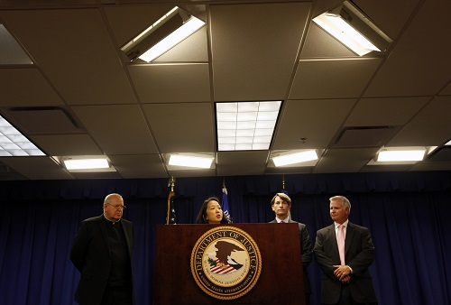

# 2016 - present: *Is it safe now?*

## 2,500 homes approved for cleanup

::::: columns
::: {.column width="50%"}
July 6, 2017

<!--[DTSC Removal Action Plan](https://www.envirostor.dtsc.ca.gov/getfile?filename=/public%2Fcommunity_involvement%2F2069721817%2FFINAL%20CLeanup%20Plan%206%20Jul%202017.pdf)-->

-   \~10k homes exposed to Pb emissions
-   State tested Pb soil in 8.2k homes
-   2.5k homes with soil Pb \>400 ppm scheduled for cleanup
:::

::: {.column width="50%"}
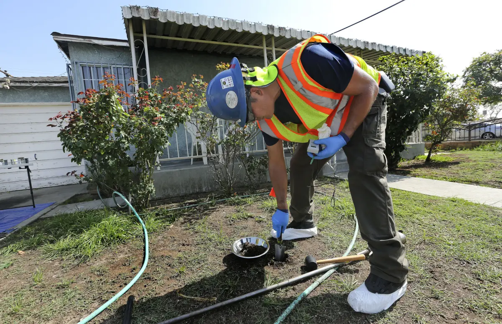{width="350px"}

[Thousands of L.A. County homes tainted with lead](https://www.latimes.com/local/california/la-me-ln-exide-what-we-know-20170806-htmlstory.html)
:::
:::::

## Cleanup progresses slowly

::::: columns
::: {.column width="40%"}
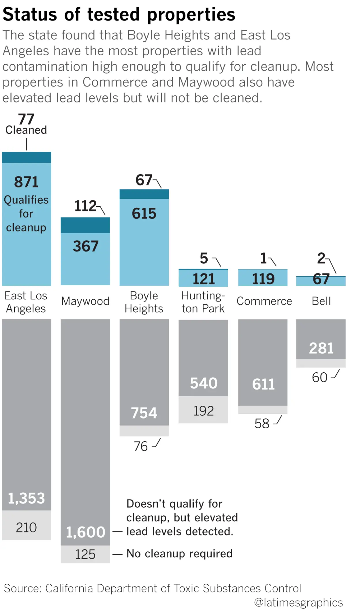{height="600px"}
:::

::: {.column width="60%"}
[The Exide plant in Vernon closed 3 years ago. The vast majority of lead-contaminated properties remain uncleaned.](https://www.latimes.com/local/lanow/la-me-exide-cleanup-20180426-story.html)
:::
:::::

## Community-academy collaboration

::::: columns
::: {.column width="45%"}


[*EYCEJ*](https://eycej.org/) partnered with [*Prof Jill Johnston*](https://faculty.sites.uci.edu/cejrl/) to investigate the cleanup [@johnston2026]
:::

::: {.column width="55%"}
> Get The Lead Out Study is a community-academic research collaboration with East Yard Communities for Environmental Justice

> We collected 1128 samples from 373 properties, of which ∼40% were cleaned by the state
:::
:::::

## Study questions Removal Action Plan

::::: columns
::: {.column width="40%"}
-   Soil Pb \>80 ppm in 39% of samples at **_cleaned_** properties
-   Outside PIA, **_soil Pb dropped 24 ppm per 1000 m_** from Exide plant
:::

::: {.column width="60%"}
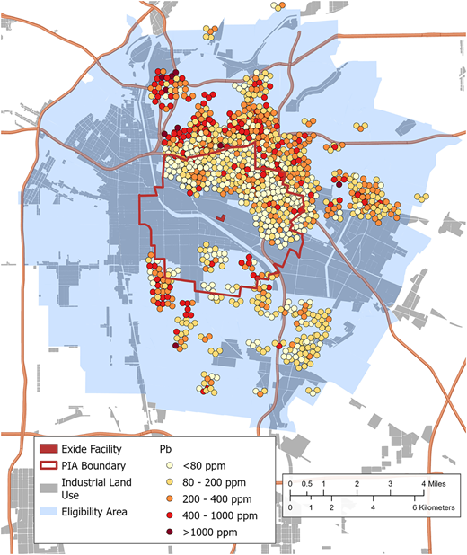{height="600px"}
:::
:::::

## Has the cleanup been effective?

::::: columns
::: {.column width="50%"}
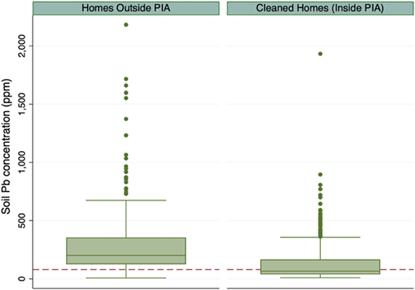
:::

::: {.column width="50%"}
Among cleaned homes:

-   Mean soil Pb in samples was not significantly \>80 ppm
-   39% of samples \>80 ppm
-   73% of homes had 1+ sample \>80 ppm
-   19% of samples \>200 ppm

**Has the cleanup been effective?**
:::
:::::

## *Generalizing from treatment to control*

**Given samples from treatment and control, what can we say about the treatment's effect?**

::::: columns
::: column
**Treatment**: a change or intervention

-   Remediating soil on a property
-   Operating an industrial facility in a neighborhood
:::

::: column
**Control**: a comparable group that has not received the treatment

-   A property pre-remediation
-   Nearby neighborhoods outside the facility's effect radius
:::
:::::

# Recap

## 1922 - 2012: *A century of pollution*

From 1922 to 2015, the Exide plant emitted lead and polluted nearby communities


## 2013 - 2015: *Shut it down*

Community protests and government investigations led to the plant's closure

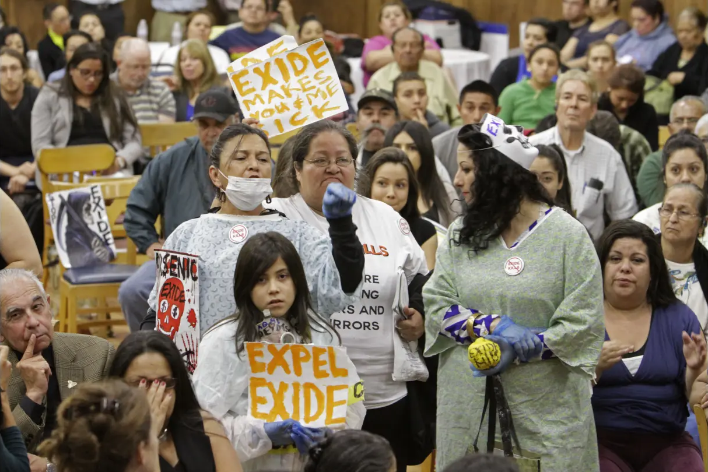

## 2016 - present: *Is it safe now?*

The largest residential cleanup in California state history, with mixed results


## Challenges of statistics

::: {.columns}

::: {.column width="33%"}

*Generalize from sample to population*


:::

::: {.column width="33%"}

*Generalize from obs. measurements to underlying construct*


:::

::: {.column width="33%"}

*Generalize from treatment to control*


:::

:::

# Preparing for success in this course

## Course structure

::: {.columns}

::: {.column width="45%"}

_Where and when do we meet?_

- Lecture
  - MW 1424 9:30-10:45
- Lab 
  - T 3022A 12:30-1:50
- Student hours
  - T 3022A 2-3
  - Th 3022A 3-4

:::

::: {.column width="45%"}

_What will I be graded on?_

- 3 homeworks
- 1 midterm
- 1 final project

:::

:::

## Course structure

::: {.columns}

::: {.column}

_What do I do before class?_

- Readings
- Pre-recorded lectures
- Pre-class "parking lot"

:::

::: {.column}

_What do I do in class?_

- Pay attention
- Participate in activities
- Connect statistics to your experiences and interests

:::

:::

## Community agreements

There are two posters at the back of the room


::: {.columns}

::: {.column}

**"How can I support _myself_ in this class?"**

:::

::: {.column}

**"How can I support _my peers_ in this class?"**

:::

:::

Reflect on these prompts and put _at least one_ sticky note on each poster

## Optimal stress

Remember, there is an optimal level of stress for learning.

If you're outside the optimal, please come to your instructors!

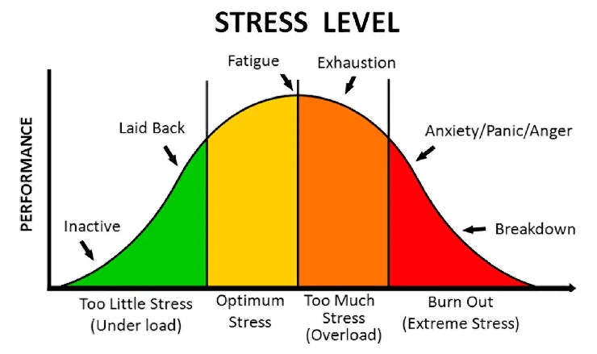

# See you tomorrow!

> It is easy to lie with statistics. It is hard to tell the truth without statistics. 
- Andrejs Dunkels

# References