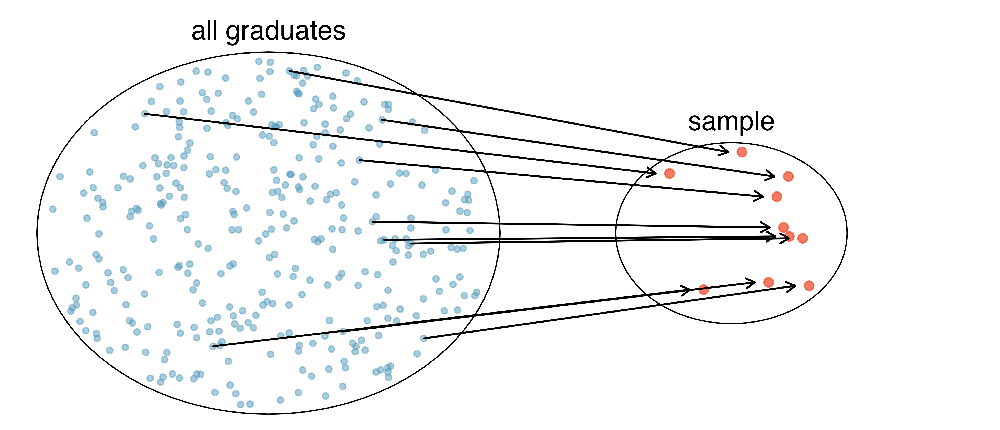
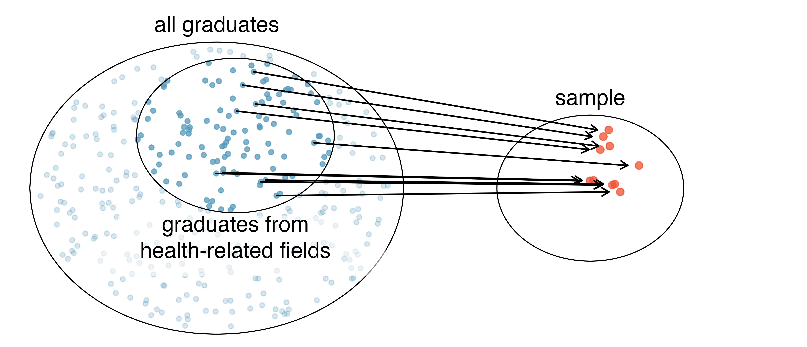
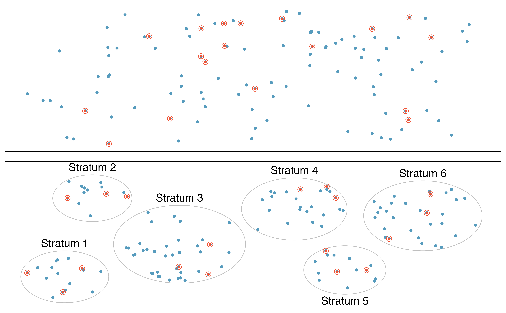

```{r}
#| label: setup
#| message: false

library(tidyverse)
set.seed(222)
theme_set(theme_bw(18))
here <- function(x) file.path("..", x)
```

# Sampling

## Learning objectives

- **Differentiate** _empirical_ and _parametric_ distributions
- **Visualize** distributions using histograms and probability density functions
- **Simulate** sampling in R

## _Empirical_ and _parametric_ samples

**Empirical**: derived directly from observations

**Parametric**: derived from a mathematical formula governed by one or a few _parameters_

## Empirical samples: random

The process of collecting real observations is how we get _empirical_ samples. 

When feasible, _simple random samples_ are most representative of the population.



## Empirical samples: biased

A truly random sample is rarely possible. Without care, there are many ways for biases to creep in. _Convenience bias_ is particularly common.



## Empirical samples: stratified

Even if simple random sampling is infeasible, sampling strategies reduce bias. For example, stratified sampling divides the population into self-similar groups, then randomly samples within those groups.



<!--

## Simulating _empirical_ samples

Given a real dataset, we can simulate empirical samples in R.

This is _so useful_ for learning concepts and tools - we'll come back to this all quarter.

## Simulating _empirical_ samples

Start with a soil lead dataset.

```{r}
soil_cores <- read_csv(here("data/exide-soil-cores.csv"))

# Visualize the whole distribution
ggplot(soil_cores, aes(pb_ppm)) +
  geom_histogram(binwidth = 20) +
  xlim(0, 1000)
```

## Draw an _empirical_ sample

Use `slice_sample()` to randomly sample observations from the dataset.

```{r}
soil_core_sample <- soil_cores |>
  slice_sample(n = 100)

ggplot(soil_core_sample, aes(pb_ppm)) +
  geom_histogram()
```

## Simulating _empirical_ samples

Remember `slice_sample()`. We will use it later this quarter to:

* Test hypotheses
* Quantify uncertainty

-->

## Example of a _parametric_ distribution

- Parametric distributions are defined by _parameters_ (instead of observed data). 
  - E.g., a _normal_ distribution has two _parameters_ - the `mean` controls location and the `sd` controls shape.

- Recall _probability density functions_ (PDFs) tell us how probable different ranges of values are. 

## Parameterizing a distribution

Let's parameterize a normal distribution with the `mean` and `sd` of the lead soil dataset.

```{r}
#| echo: true
soil_cores |>
  summarize(
    mean_pb_ppm = mean(pb_ppm),
    sd_pb_ppm = sd(pb_ppm)
  )
```

## Probability density function

- The PDF describes the relative probability of observing different values.
- This PDF is a normal distribution with parameters matching the lead soil dataset. 

```{r}
tibble(
  x = seq(-860, 1366, length.out = 1000),
  pdf = dnorm(x, mean = 253, sd = 371)
) |>
  ggplot(aes(x, pdf)) +
  geom_line(linewidth = 1.5)
```

## A universe of _parametric_ distributions

- The _normal_ distribution is a poor stand-in for the lead data (symmetric, possibly negative).
- A different family (e.g. the _lognormal_) could do a better job. We'll cover these more in later weeks.

::: {.columns}

::: {.column}

```{r}
#| echo: false

ggplot(soil_cores, aes(pb_ppm)) +
  geom_histogram(binwidth = 20) +
  xlim(-860, 1366)
```

:::

::: {.column}

```{r}
#| echo: false

tibble(
  x = seq(-860, 1366, length.out = 1000),
  normal = dnorm(x, mean = 253, sd = 371),
  lognormal = dlnorm(
    x,
    meanlog = mean(log(soil_cores$pb_ppm)),
    sdlog = sd(log(soil_cores$pb_ppm))
  )
) |>
  pivot_longer(-x, names_to = "family", values_to = "pdf") |>
  ggplot(aes(x, pdf, color = family)) +
  geom_line(linewidth = 1.5) +
  xlim(-860, 1366) +
  scale_color_manual(values = c("#1b9e77", "#d95f02")) +
  theme(legend.position = "inside", legend.position.inside = c(0.8, 0.8))
```

:::

:::

## Sampling parametric distributions

- We will sample from parametric distributions frequently in this course.
- Think of the height of the PDF as the chance of observing a nearby value.

```{r}
set.seed(222)
normal_sample <- tibble(
  x = rnorm(25, mean = 253, sd = 371),
  pdf = dnorm(x, mean = 253, sd = 371)
)

tibble(
  x = seq(-860, 1366, length.out = 1000),
  pdf = dnorm(x, mean = 253, sd = 371)
) |>
  ggplot(aes(x, pdf)) +
  geom_segment(
    aes(xend = x, yend = 0),
    normal_sample,
    color = "firebrick",
    linewidth = 1.25
  ) +
  geom_line(linewidth = 1.5)
```

# Recap

## _Empirical_ and _parametric_ samples

**Empirical**: derived directly from observations.

- _E.g., lead concentrations in soil cores._

**Parametric**: derived from a mathematical formula governed by one or a few _parameters_.

- _E.g., a normal distribution with a `mean` and `sd`._

## Sampling strategies

- Simple random is most representative of the population, but often infeasible.
- Sampling bias misleads inferences about the population.
- Sampling strategies (e.g. stratification) work around biases.


## Parametric distributions

- Parametric distributions are mathematical functions governed by parameters.
- We use them as theoretical stand-ins for populations.
- PDF says how probable observations are, given parameters.

```{r}
set.seed(222)
normal_sample <- tibble(
  x = rnorm(25, mean = 253, sd = 371),
  pdf = dnorm(x, mean = 253, sd = 371)
)

tibble(
  x = seq(-860, 1366, length.out = 1000),
  pdf = dnorm(x, mean = 253, sd = 371)
) |>
  ggplot(aes(x, pdf)) +
  geom_segment(
    aes(xend = x, yend = 0),
    normal_sample,
    color = "firebrick",
    linewidth = 1.25
  ) +
  geom_line(linewidth = 1.5)
```

# Let's see it in R
