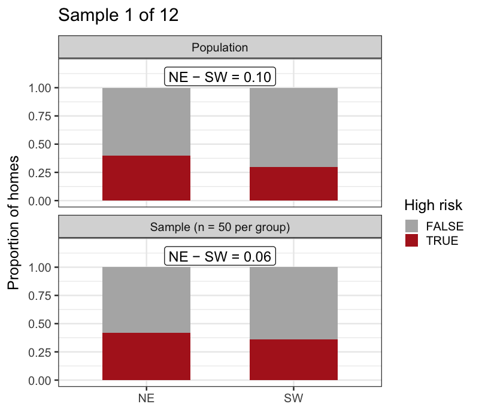
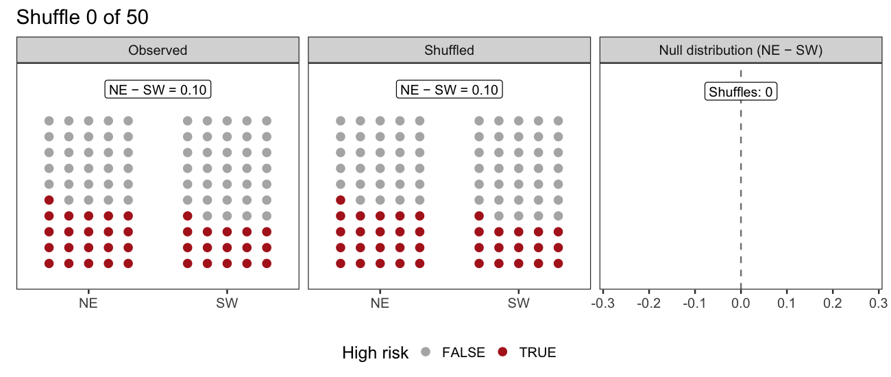
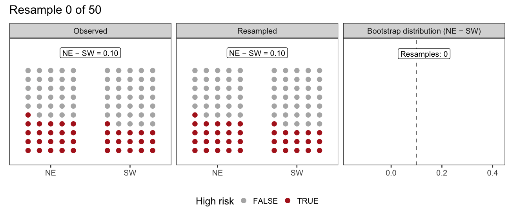

```{r}
#| label: setup
#| message: false

library(tidyverse)
set.seed(222)
theme_set(theme_bw(18))
here <- function(x) file.path("..", x)
```

# Permutation and Bootstrapping

## Learning objectives

- **Apply** randomization to inferential questions
- Use **permutation** to quantify uncertainty for _yes/no_ questions
- Use **bootstrapping** to quantify uncertainty for _how much?_ questions

# Think like a statistician

## Statistics is part of the scientific method

1. Ask a question
2. Formulate a (scientific) hypothesis
3. Conduct a study, experimental or observational
4. Analyze data
5. Interpret and communicate the results

## Statistics is part of the scientific method

1. _Where did lead from the Exide plant end up?_
2. _Wind carried more lead NE than SW._
3. _Gather soil cores to measure lead concentrations across the region._
4. _STATS STATS STATS_
5. Interpret and communicate the results

## Two types of hypotheses

::: {.columns}

::: {.column}

**What a scientist means**

**Hypothesis:** a testable, causal explanation for an observation

> Lead emissions spread via wind.

:::

::: {.column}

**What a statistician means**

**Hypothesis**: a quantitative statement about a parameter of the population

> The proportion of homes downwind of the plant with elevated lead levels is greater than those upwind.

:::

:::

## Variation is natural

A statistician knows that a difference in a sample (between proportions, means, etc) is insufficient to evaluate a hypothesis.

Sampling is random! 

The real question: is the difference _bigger_ than we'd expect from sampling? Or is it _consistent_ with sampling variation?

## Variation is natural



## Assess the evidence

Given that variation is natural in sampling, how do we assess evidence? 

We can't gather new data, so we design _statistical experiments_ based on the sample we have.

# Permutation

## Permutation is a _statistical experiment_ for yes/no questions

**Question**: Is the proportion of high risk homes higher downwind than upwind?

Let's reframe this as:

**Question**: _If_ there was no relationship between lead risk and wind direction, _then_ how often would our sample be observed?

## Random to the rescue

We can _simulate_ the "what if there's no relationship?" scenario by _randomizing_ the predictor variable.

Randomization _breaks the link_ between predictor and response, but keeps all the variation from the sample.

## Procedure

$H_0$: there is no relationship/effect/etc

$H_A$: there is a relationship/effect/etc

1. Calculate the _observed_ value of the statistic (e.g., a difference in proportions)
2. Shuffle the predictor variable and recalculate the statistic.
3. Repeat step 2 until the cows come home (_null distribution_ of the statistic)
4. Compare the observed value to the null statistic (_p-value_)
5. Reject, or fail to reject, the _null hypothesis_

## Permutation visualized



## Compare the observed to the null statistic
```{r}
#| label: observed-sample

# Same observed sample as the permutation animation: 50 homes per direction,
# 21 high risk in NE and 16 high risk in SW
homes <- tibble(
  direction = rep(c("NE", "SW"), each = 50),
  high_risk = c(
    rep(c(TRUE, FALSE), c(21, 29)),
    rep(c(TRUE, FALSE), c(16, 34))
  )
)

obs_diff <- mean(homes$high_risk[homes$direction == "NE"]) -
  mean(homes$high_risk[homes$direction == "SW"])
```

```{r}
#| label: null-distribution

# Shuffle direction labels 10,000 times, recalculating NE - SW each time
null_diffs <- map_dbl(1:10000, \(i) {
  shuffled <- sample(homes$direction)
  mean(homes$high_risk[shuffled == "NE"]) -
    mean(homes$high_risk[shuffled == "SW"])
})

pvalue <- mean(null_diffs > obs_diff)

p_null <- tibble(diff = null_diffs) |>
  mutate(in_tail = diff > obs_diff) |>
  ggplot(aes(diff, fill = in_tail)) +
  geom_histogram(binwidth = 0.04, colour = "white") +
  geom_vline(xintercept = obs_diff, linewidth = 1) +
  scale_fill_manual(values = c(`FALSE` = "grey70", `TRUE` = "steelblue")) +
  labs(
    x = "NE − SW (null distribution)",
    y = "Count",
    title = str_glue("p = {round(pvalue, 2)}")
  ) +
  theme(legend.position = "none")

p_null
```

## Interpret the p-value

A **p-value** is _the probability of seeing the observed sample, if the null hypothesis is true_. That's it.

If p is less than some threshold (often 0.05 by default), then we say there is a _statistically significant_ result. This means the sample is improbable under chance alone.

## Don't misinterpret the p-value

The following are common misconceptions:

* A p-value is the probability that the null hypothesis is true
* A statistically significant result is meaningful by real-world standards
* A statistically non-significant result means there's no effect

## Permutation recap

* Given only one sample, how do we estimate the natural variation of the statistic? With randomization!
* Permutation breaks the connection between the predictor and response, simulating the variation of the statistic expected by chance.
* Permutation yields a p-value, which says if your result is _statistically significant_.
  * _You are wise enough to hold complexity._

# Bootstrapping

## Bootstrapping is a _statistical experiment_ for "how much?" questions

**Question**: _How much_ higher is the proportion of high risk homes downwind than upwind?

Let's reframe this as:

**Question**: What's the _interval_ that we _confidently_ think contains the population-level parameter?

## Random to the rescue

- We can _simulate_ the variation in our statistic by _resampling_ the observations.

- We're making the critical assumption that our sample is representative of the population
  - Instead of getting new samples from the population (too hard!) we get "bootstrapped" samples from the sample itself.

## Procedure

1. Calculate the _observed_ value of the statistic (e.g., a difference in proportions)
2. Resample the observations _with replacement_ and recalculate the statistic.
3. Repeat step 2 until the cows come home (_sampling distribution_)
4. Find the range containing a large percentage of the sampling distribution (_confidence interval_)

## Bootstrapping visualized



## Find your _confidence interval_

```{r}
#| label: bootstrap-distribution

# Resample homes with replacement within each direction 10,000 times,
# recalculating NE - SW each time
boot_diffs <- map_dbl(1:10000, \(i) {
  resampled <- homes |>
    group_by(direction) |>
    slice_sample(prop = 1, replace = TRUE) |>
    ungroup()
  mean(resampled$high_risk[resampled$direction == "NE"]) -
    mean(resampled$high_risk[resampled$direction == "SW"])
}) |>
  # Differences are multiples of 0.02; rounding stops floating point error from
  # splitting a bin at the CI boundary
  round(2)

ci <- quantile(boot_diffs, c(0.025, 0.975))

p_ci <- tibble(diff = boot_diffs) |>
  mutate(in_ci = between(diff, ci[1], ci[2])) |>
  ggplot(aes(diff, fill = in_ci)) +
  geom_histogram(binwidth = 0.02, colour = "white") +
  geom_vline(xintercept = obs_diff, linewidth = 1) +
  scale_fill_manual(values = c(`FALSE` = "grey70", `TRUE` = "darkorange")) +
  labs(
    x = "NE − SW (sampling distribution)",
    y = "Count",
    title = sprintf("95%% CI: [%.2f, %.2f]", ci[1], ci[2])
  ) +
  theme(legend.position = "none")

p_ci
```

## Interpret your confidence interval

A **confidence interval** is _a range of values that you are confident contains the population parameter_. 

But wait... what exactly are we confident in?

If we repeated this procedure 100 times, about 95 of those CIs would contain the population parameter.

Our confidence is in the procedure's long-run accuracy.

## Don't misinterpret your confidence interval

The following are common misconceptions:

* There's a 95% chance the 95% CI contains the population parameter
* Larger sample sizes yield more accurate confidence intervals

## Bootstrapping recap

* Given only one sample, how do we estimate the natural variation of the statistic? With randomization!
* Bootstrapping draws "new" samples from the original, simulating the variation of the statistic expected by sampling.
* Bootstrapping yields a confidence interval, which describes a range the actual parameter probably falls in.
  * CIs rigorously communicate uncertainty.

## Permutation vs bootstrapping

::: {.columns}

::: {.column}

Permutation simulates a scenario with _no relationship_ to answer "yes/no" questions.

```{r}
p_null
```

:::

::: {.column}

Bootstrapping simulates the _original scenario_ to answer "how much?" questions.

```{r}
p_ci
```

:::

:::

