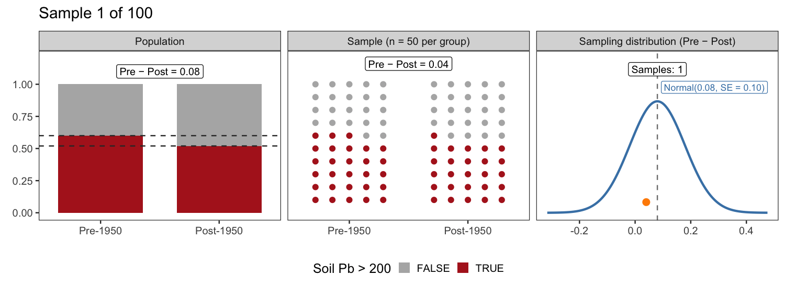

```{r}
#| label: setup
#| message: false

library(tidyverse)
set.seed(222)
theme_set(theme_bw(22))
```

# Mathematical Models of Inference

## Learning objectives

- Use **parametric distributions** to represent **sampling distributions**
- **Relate** mathematical models of inference to their randomization-based counterparts
- **Simulate** a _data generating process_ to check your understanding

# Use parametric distributions to represent sampling distributions

## Sampling is normal

- Given sufficient _independent_ observations, many sampling distributions converge to the **normal distribution**
- We can use the normal distribution as a stand-in the _entire_ sampling distribution from just one sample

Sample -> Normal distribution -> Sampling distribution

## Normal sampling visualized



## Parameterizing the sampling distribution

Recall a normal distribution's has two parameters: the mean and the standard deviation

**Our goal** is to estimate the mean and standard deviation of the sampling distribution

## Parameterizing the sampling distribution

::: {.columns}

::: {.column width="55%"}

::: {style="font-size: 75%;"}

$$
\mu = p_1 - p_2
$$

$$
\sigma = \sqrt{\frac{p_1 (1 - p_1)}{n_1} + \frac{p_2 (1 - p_2)}{n_2}}
$$

:::

:::

::: {.column width="45%"}

Let $p_1 = 0.60$, $p_2 = 0.52$, $n_1 = n_2 = 50$

```{r}
p1 <- 0.6
p2 <- 0.52
n1 <- n2 <- 50
se <- sqrt(p1 * (1 - p1) / n1 + p2 * (1 - p2) / n2)
sampling_distribution <- tibble(
  `Difference in proportions` = seq(
    p1 - p2 - 3 * se,
    p1 - p2 + 3 * se,
    by = 0.001
  ),
  `Probability density` = dnorm(
    `Difference in proportions`,
    mean = p1 - p2,
    sd = se
  )
)
ggplot(
  sampling_distribution,
  aes(`Difference in proportions`, `Probability density`)
) +
  geom_line() +
  geom_vline(xintercept = p1 - p2, linetype = "dashed")
```

:::

:::

# Relate mathematical models of inference to their randomization-based counterparts

## Confidence intervals, two ways

With **bootstrapping**, we resampled the sample to estimate the **sampling distribution**

With a **mathematical model**, we use the normal distribution to estimate the **sampling distribution**

## Bootstrapping revisited


## Confidence interval using a mathematical model

1. Estimate the parameters of the normal distribution that approximates the sampling distribution. 

::: {style="font-size: 75%;"}

$$
\mu = \hat p_1 - \hat p_2
$$

$$
\sigma = SE = \sqrt{\frac{\hat p_1 (1 - \hat p_1)}{n_1} + \frac{\hat p_2 (1 - \hat p_2)}{n_2}}
$$

:::

We call our estimate of $\sigma$ the **standard error**

## Confidence interval using a mathematical model

2. Find the interval containing _x_% of the probability (e.g., 95% for a 95% CI)

```{r}
ggplot(
  sampling_distribution,
  aes(`Difference in proportions`, `Probability density`)
) +
  geom_ribbon(
    aes(ymin = 0, ymax = `Probability density`),
    data = filter(
      sampling_distribution,
      between(
        `Difference in proportions`,
        p1 - p2 - 1.96 * se,
        p1 - p2 + 1.96 * se
      )
    ),
    fill = "cornflowerblue",
    alpha = 0.25
  ) +
  geom_line() +
  geom_vline(xintercept = p1 - p2, linetype = "dashed") +
  geom_vline(
    xintercept = p1 - p2 + c(-1.96, 1.96) * se,
    colour = "cornflowerblue",
    linetype = "dotted"
  ) +
  annotate(
    "label",
    x = p1 - p2,
    y = dnorm(0, sd = se) * 1.1,
    label = "hat(p)[1] - hat(p)[2]",
    parse = TRUE,
    size = 6
  ) +
  annotate(
    "label",
    x = p1 - p2 + c(-1.96, 1.96) * se,
    y = dnorm(0, sd = se) * 0.4,
    label = c(
      "atop(Lower~bound, hat(p)[1] - hat(p)[2] - 1.96 %*% SE)",
      "atop(Upper~bound, hat(p)[1] - hat(p)[2] + 1.96 %*% SE)"
    ),
    parse = TRUE,
    colour = "cornflowerblue",
    size = 5
  ) +
  scale_y_continuous(expand = expansion(mult = c(0.05, 0.15)))
```

## P-values, two ways

With **permutation**, we shuffled the predictor to estimate the **null distribution**

With a **mathematical model**, we use the normal distribution to estimate the **null distribution**

## Permutation revisited


## P-value using a mathematical model

1. Estimate the parameters of the normal distribution that approximates the null distribution. 

::: {style="font-size: 75%;"}

$$
\mu = 0
$$

$$
\sigma = SE = \sqrt{\hat p_{pool} (1 - \hat p_{pool}) \left( \frac{1}{n_1} + \frac{1}{n_2} \right) }
$$

:::

Why $p_{pool}$ instead of $p_1$ and $p_2$?

## P-value using a mathematical model

2. Find the probability of observing _at least_ $\hat p_1 - \hat p_2$, _if_ the null hypothesis is true.

p-value = `r round(pnorm(p1 - p2, mean = 0, sd = se, lower.tail = FALSE), 2)` 

```{r}
ppool <- (p1 * n1 + p2 * n2) / (n1 + n2)
se <- sqrt(ppool * (1 - ppool) * (1 / n1 + 1 / n2))
null_distribution <- tibble(
  `Difference in proportions` = seq(
    -3 * se,
    3 * se,
    by = 0.001
  ),
  `Probability density` = dnorm(
    `Difference in proportions`,
    mean = 0,
    sd = se
  )
)
ggplot(
  null_distribution,
  aes(`Difference in proportions`, `Probability density`)
) +
  geom_ribbon(
    aes(ymin = 0, ymax = `Probability density`),
    data = filter(
      null_distribution,
      between(
        `Difference in proportions`,
        p1 - p2,
        Inf
      )
    ),
    fill = "cornflowerblue",
    alpha = 0.25
  ) +
  geom_line() +
  geom_vline(xintercept = 0, linetype = "dashed") +
  geom_vline(
    xintercept = p1 - p2,
    colour = "cornflowerblue",
    linetype = "dotted"
  ) +
  annotate(
    "label",
    x = 0,
    y = dnorm(0, sd = se) * 1.1,
    label = "H[0]: p[1] - p[2] == 0",
    parse = TRUE,
    size = 6
  ) +
  annotate(
    "label",
    x = p1 - p2,
    y = dnorm(p1 - p2, sd = se) * 1.1,
    label = "atop(Observed, hat(p)[1] - hat(p)[2])",
    parse = TRUE,
    colour = "cornflowerblue",
    size = 5,
    hjust = -0.1
  ) +
  scale_y_continuous(expand = expansion(mult = c(0.05, 0.15)))
```

## Conditions when mathematical models work well

Two conditions are required for the mathematical model approach to work well:

- Independence
- Sample size

## Independence

- Data are **independent** when observations don't influence each other. 
- **Controlled experiments** are designed to produce independent observations. In **observational studies**, complete independence is rare.
- Common sources of dependence include:
  - Geographic or temporal proximity
  - Repeated measures from the same entity
  - Shared ancestry or social group

## Sample size

- The normal approximation fails more often for **very small samples**
- As a guideline, each group in the sample should have **at least 10 expected successes and failures**
- $p_1 n_1$, $(1 - p_1) n_1$, $p_2 n_2$, and $(1 - p_2) n_2$ all $\ge 10$
- When proportions are close to 0 or 1, this condition gets harder to meet

# Simulate a _data generating process_ to check your understanding

## Statistical thinking is not _dark magic_.

- The rules and procedures are verifiable through **simulation**.
- Get in the habit of verifying your understanding through simulation.
- Let's investigate the claim that the **_standard error of a difference in proportions_** is:

$$
SE = \sqrt{\frac{\hat p_1 (1 - \hat p_1)}{n_1} + \frac{\hat p_2 (1 - \hat p_2)}{n_2}}
$$

## Simulating a _data generating process_

- The **_data generating process_** (DGP) is a model describing how the sample emerges from the population. 
- Consider the _difference in proportions_ between pre- and post-1950 homes having soil Pb > 200. The DGP is:
  - Each observation is _TRUE_ or _FALSE_
  - Observations within and across groups are independent
  - Observations within groups are _TRUE_ with a proportion of $p_1$ and $p_2$, respectively

## Steps in the simulation

1. Choose the parameters for your simulation

$$
\begin{align}
p_1 &= 0.60 \\
n_1 &= 25 \\
p_2 &= 0.52 \\
n_2 &= 25
\end{align}
$$

## Steps in the simulation

2. Simulate a sample using `r____()` functions and calculate the sample statistic
  -  `rbinom()` for binary _TRUE_/_FALSE_ variables

3. Continue simulating samples until you reach critical mass (10k usually good)

## Steps in the simulation

4. Check your simulation results against the claim 
  - _Do 95% of sample statistics fall within 1.96 SEs of the population parameter?_

## Let's do it in R!
